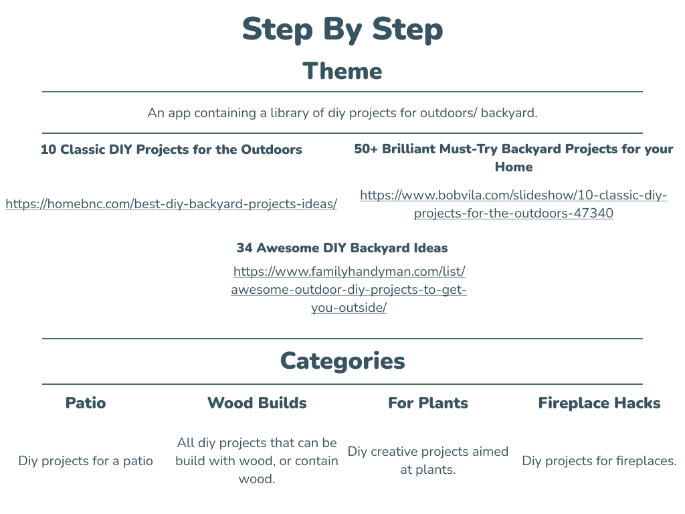
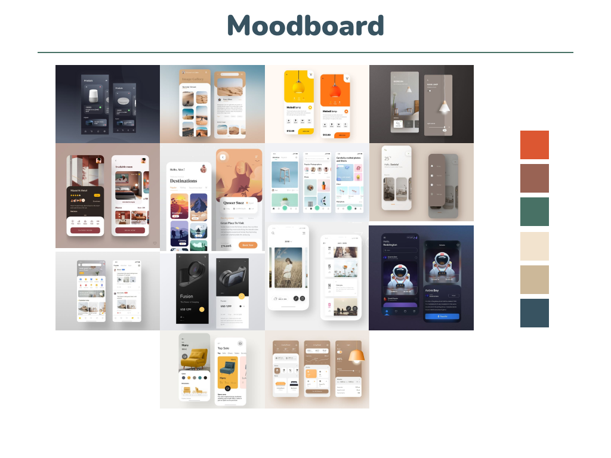
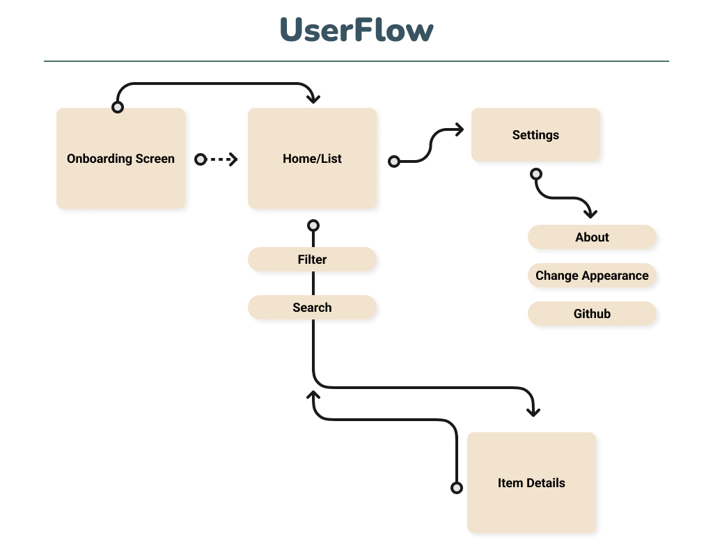
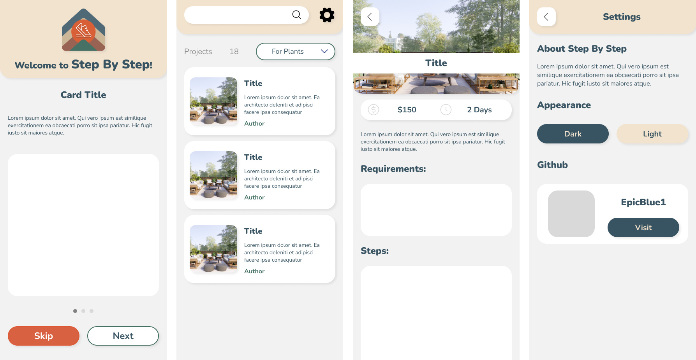
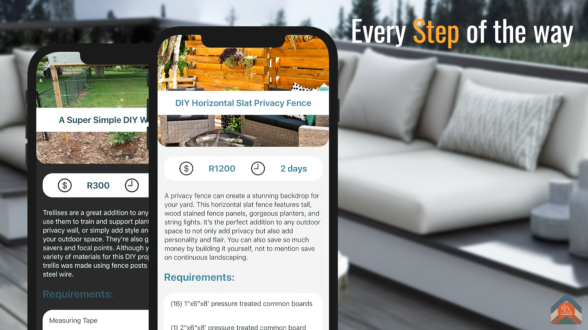
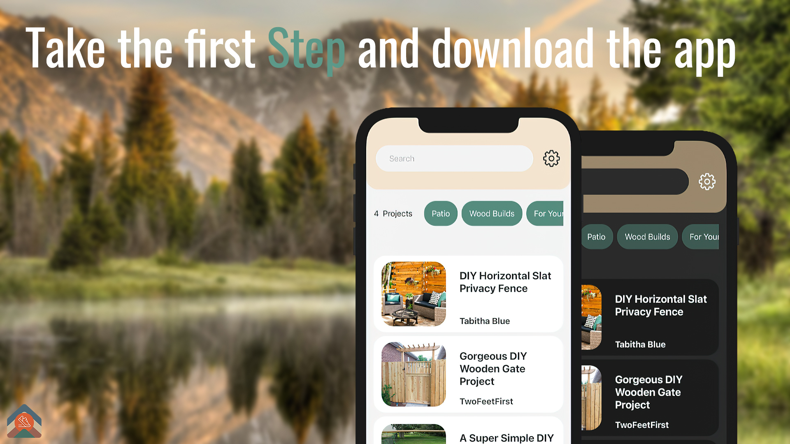
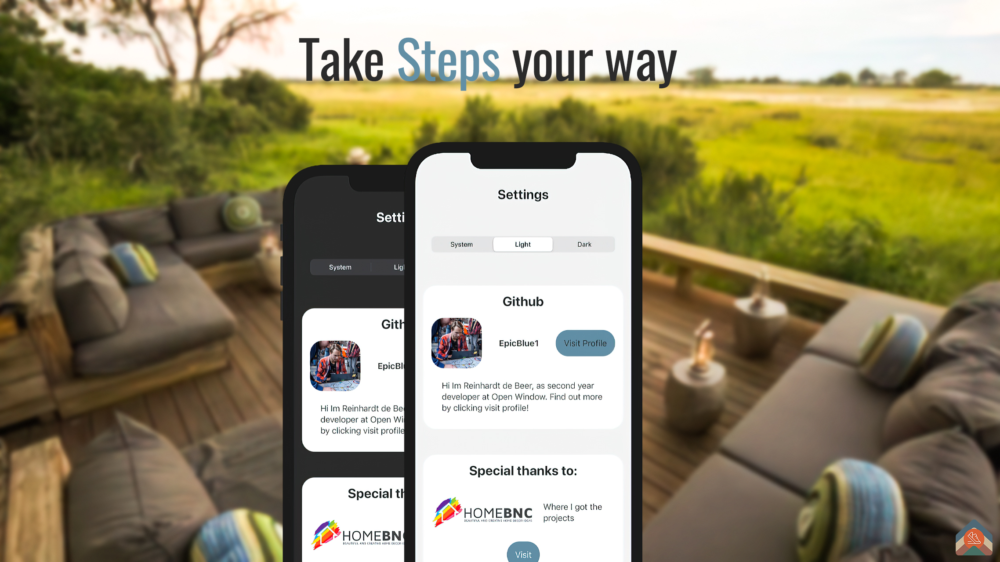
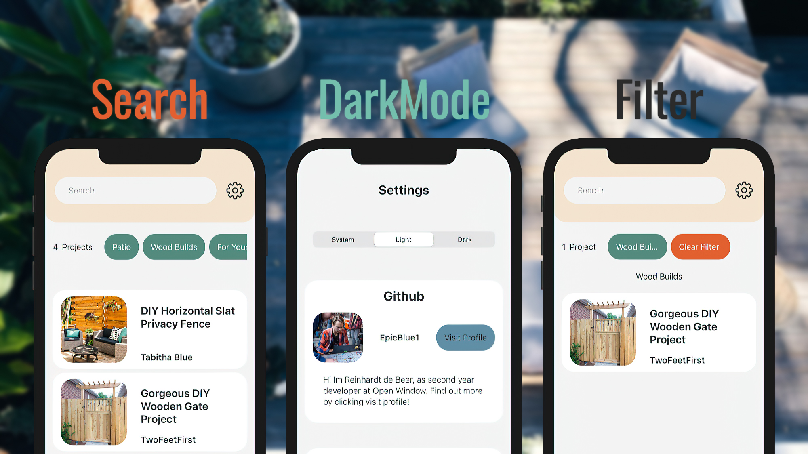
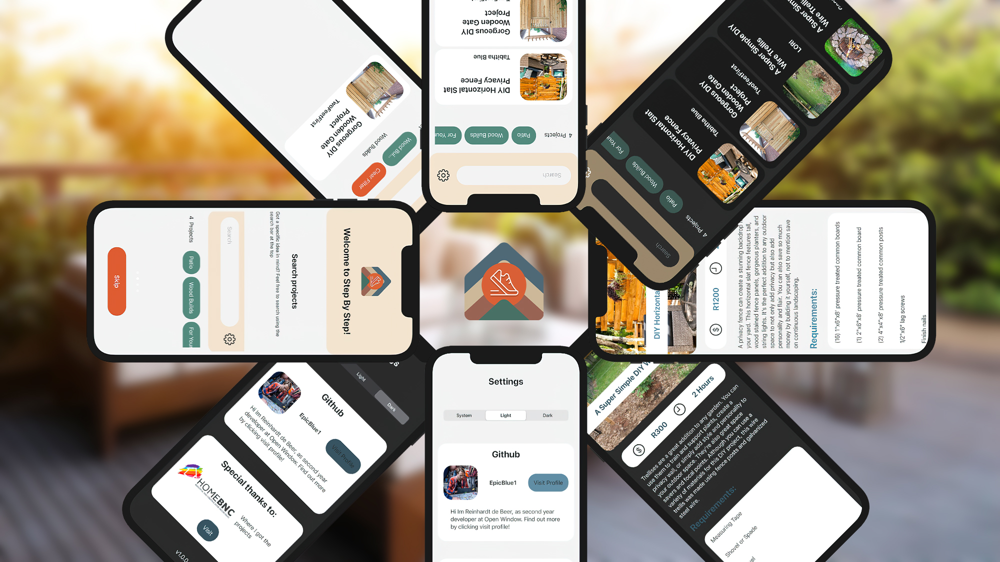

## Repo Info


Reinhardt de Beer
21100115 - DV_204_T4

# Step By Step

<p align="center">
    
</p>

This term, I learned the fundamentals of iOS development by designing and building an app with Xcode IDE and swiftUI to manage recipes/library items. My theme chosen was OutDoors DIY, specifically for Patios, Fireplaces, plants and Wood Builds.

## Table of contents

- [Installation](#Installation)
- [Build With](#Build-With)
- [Features](#Features-and-Functions)
- [Development-Process](#Development-Process)
  - [Wireframes](#Wireframes)
  - [Challenges](#Challenges)
  - [Challenges](#Above-And-Beyond)
  - [Challenges](#Future-Implementation)
- [Final-Outcome](#Final-Outcome)
  - [Mockups](#Mockups)
  - [Video-Demonstration](#Video-Demonstration)
  - [Final-Outcome](#Final-Outcome)
- [Authors](#Authors)
- [License](#License)
- [Contact](#Contact)

## Installation

1.  GitHub Desktop </br>
    Enter `https://github.com/EpicBlue1/StepByStep.git` into the URL field and press the `Clone` button.

2.  Clone Repository </br>
    Run the following in the command-line to clone the project:

    ```sh
    git clone https://github.com/EpicBlue1/StepByStep.git
    ```

        Open `Xcode` and select `File | Open...` from the menu. Select cloned directory and press `Open` button

3.  No Dependencies required </br>

4.  An API key is not required

## Build With

| Name              | Link                                       |
| ----------------- | ------------------------------------------ |
| <p>Xcode 12.4</p> | https://developer.apple.com/xcode/         |
| <p>SwiftUI</p>    | https://developer.apple.com/xcode/swiftui/ |

## Features and Functions

- Utilizes App Storage to only show OnBoarding when the user opens the app the first time
- Search Diy Projects
- Filter through 4 Categories of Diy Projects and clear filter
- Dark mode and Light mode switch within settings

## Development Process

### Theme and Research

With an initial idea in mind the theme was explored and various Diy project websites to get an idea of the data structure.

<p align="center">
    
</p>

### MoodBoard

With the idea explored inspiration for the visual look needed to be explored getting the idea for color use and ui implementation.

<p align="center">
    
</p>

[Pinterest Board For Concept](https://za.pinterest.com/debeer0072/ios_term_4/)

### UserFlow

Planning out the user flow proved to be useful for planning all the screens as well as the functionality and features.

<p align="center">
    
</p>

### Wireframes

Final wireframes:

<p align="center">
    
</p>

## Challenges

- Using an emulator to be able to use Xcode
- Understanding how SwiftUI passes arrays from one view to another
- SwiftUI's errors not being clear

## Future Implementation

- Pull data from an API
- Visual Clean up
- Being able to add your own Projects
- More Images within steps
- Favorite Projects

## Final Outcome

### Mockups

<p align="center">
    
    
    
    
    
</p>

## Video Demonstration

To see a run through of the application, click below:

[View Demonstration](https://youtu.be/KTYC9XM31s4)

## Authors

- **Reinhardt de Beer** - [EpicBlue1](https://github.com/EpicBlue1)

## License

Distributed under the MIT License. See `LICENSE` for more information.

## Contact

- **Reinhardt de Beer** - [21100115@virtualwindow.co.za](mailto:21100115@virtualwindow.co.za) - [@rdb_fotopatat](https://www.instagram.com/rdb_fotopatat/)
- **Project Link** - https://github.com/EpicBlue1/StepByStep
